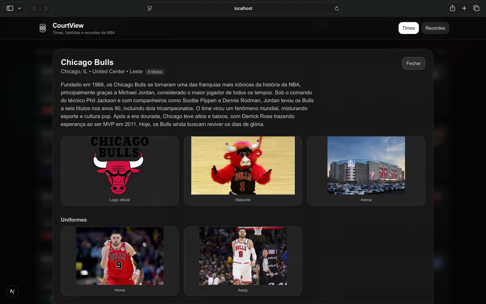
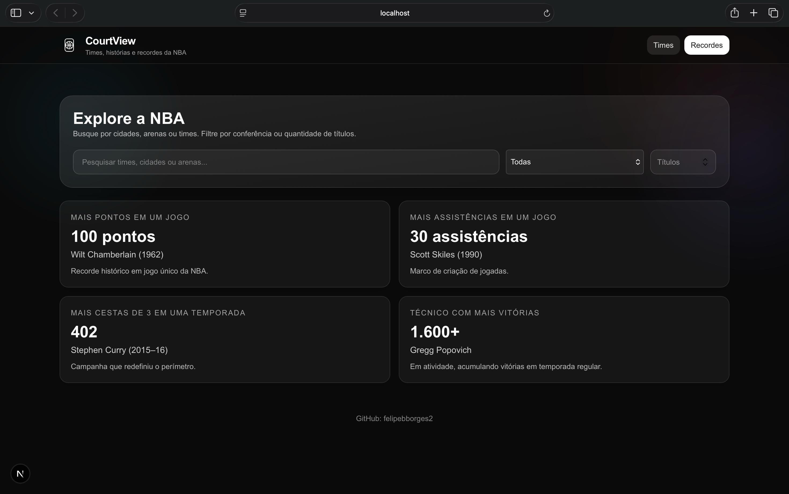

# CourtView 🏀  
A clean, modern NBA analytics dashboard built with Next.js, featuring team views, color-coded layout, player sections, and dynamic data organization.

### 🔗 Live Demo  
https://courtview.vercel.app

---

## 🎯 Overview  
CourtView is a basketball analytics interface inspired by the visual identity of NBA franchise dashboards.  
It presents team information, logos, colors, and details in a polished UI designed for clarity, speed, and immersion.

This project highlights strong UI/UX design, organized layout structure, reusable components, and elegant styling using Tailwind CSS.

---

## 🚀 Features
- 🏀 **Teams overview with official team colors**
- 🎨 **Dynamic color-coded interface for each franchise**
- 📋 **Roster and player sections**
- 🖼️ **High-quality team logos and identity**
- 📱 **Fully responsive layout**
- ⚡ **Fast, optimized Next.js rendering**
- ☁️ **Deployed on Vercel**

---

## 🧠 Tech Stack


---

## 🖼️ Screenshots  

### 🖥️ Dashboard


### 🏀 Team View


### 🌟 Records



---

## 📦 Installation & Setup

```bash
git clone https://github.com/felipebborges2/courtview.git
cd courtview
npm install
```

---

## 🤝 Contributions
PRs, issues and feature suggestions are welcome.

---

📄 License
MIT License © 2025 — Felipe Borges

---